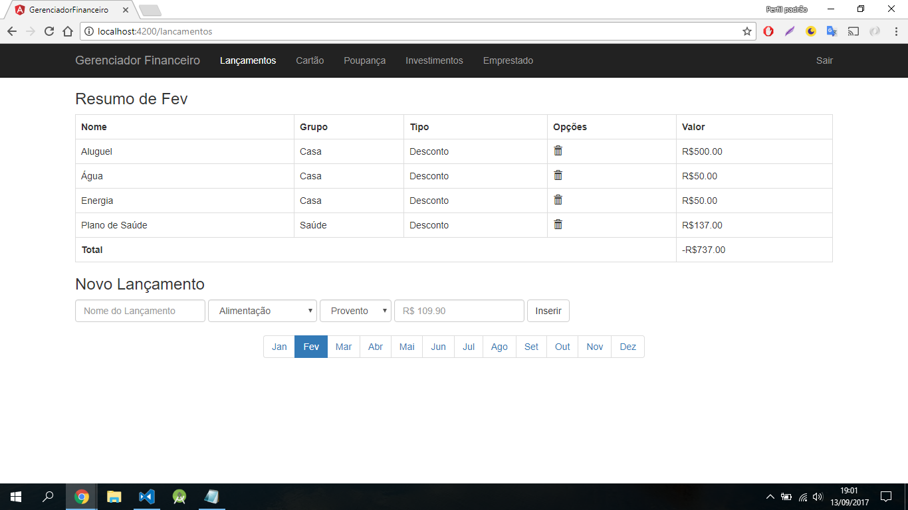

# GerenciadorFinanceiro
Um pequeno gerenciador financeiro feito com Angular2 (que acabou virando 4 no meio do caminho. xD) com armazenamento no firebase.

## Table of Contents
 - [Getting Started](#getting-started)
 - [Use Cases](#use-cases)
 - [App Preview](#app-preview)
 - [Deploying](#deploying)

## Getting Started
* Clone this repository: `git clone https://github.com/gamartins/gerenciador-financeiro.git`
* Run npm install from the project root.
* Configure the file `environment.ts` with the firebase api data.
* Run `ng serve` in a terminal from the project root.

## Use Cases
* SignIn Component - [ [Template](https://github.com/gamartins/gerenciador-financeiro/blob/master/src/app/signin/signin.component.html) | [Code](https://github.com/gamartins/gerenciador-financeiro/blob/master/src/app/signin/signin.component.ts) | [Tests](https://github.com/gamartins/gerenciador-financeiro/blob/master/src/app/signin/signin.component.spec.ts) ]
* Signup Component - [ [Template](https://github.com/gamartins/gerenciador-financeiro/blob/master/src/app/signup/signup.component.html) | [Code](https://github.com/gamartins/minha-dieta/blob/master/src/pages/search/search.ts) | [Tests](https://github.com/gamartins/gerenciador-financeiro/blob/master/src/app/signup/signup.component.spec.ts) ]
* Lancamentos Component - [ [Template](https://github.com/gamartins/gerenciador-financeiro/blob/master/src/app/lancamento/lancamento.component.html) | [Code](https://github.com/gamartins/gerenciador-financeiro/blob/master/src/app/lancamento/lancamento.component.ts) | [Tests](https://github.com/gamartins/gerenciador-financeiro/blob/master/src/app/lancamento/lancamento.component.spec.ts) ]
* CartaoCredito Component - [ [Template](https://github.com/gamartins/gerenciador-financeiro/blob/master/src/app/cartao-credito/cartao-credito.component.html) | [Code](https://github.com/gamartins/gerenciador-financeiro/blob/master/src/app/cartao-credito/cartao-credito.component.ts) | [Tests](https://github.com/gamartins/gerenciador-financeiro/blob/master/src/app/cartao-credito/cartao-credito.component.spec.ts) ]
* Poupanca | Investimentos | Emprestado Component - [ [Template](https://github.com/gamartins/gerenciador-financeiro/blob/master/src/app/aplicacoes-financeiras/aplicacoes-financeiras.component.html) | [Code](https://github.com/gamartins/gerenciador-financeiro/blob/master/src/app/aplicacoes-financeiras/aplicacoes-financeiras.component.ts) | [Tests](https://github.com/gamartins/gerenciador-financeiro/blob/master/src/app/aplicacoes-financeiras/aplicacoes-financeiras.component.tss) ]

## App Preview
All app preview screenshots were taken by running `ionic serve --lab`.
### SignIn Component

### Signup Component

### Lancamentos Component

### CartaoCredito Component

### Poupanca Component

### Investimentos Component

### Emprestado Component

To see more images of the webapp, check out the [screenshots directory](https://github.com/gamartins/minha-dieta/tree/master/screenshots)!
